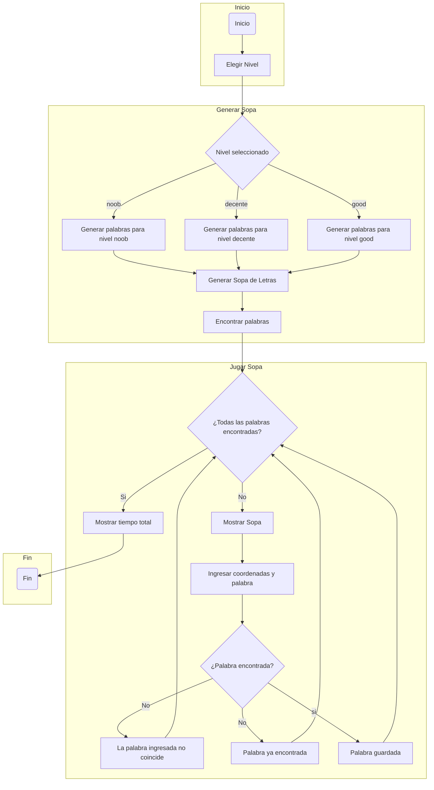

# PROYECTO FINAL Agrocode Industry

**Nombre del grupo:**

Agrocode Industry

**Integrantes:**

* Paula Jiménez Quiñones
* Mario Alejandro Martinez
* David Rodriguez Rueda

**Logo:**


## Solución del problema:

#### Problema
**Instrucción**

Construir una aplicación que emule una sopa de letras utilizando Python.

Condiciones:

* Código original
* Uso de herramientas vistas en el curso
* Interacción y manejo a través de la consola
* Definidido por el usuario:
* Matriz del tamaño de la sopa de letras (Min: 10x10, Max: 30x30)
* Ingreso de las palabras: Lista de coordenadas, Strings.
* Nivel de dificultad: Asociado a cantidad de palabras, verticales, horizontales, diagonal.

---

### Análisis del problema

#### Análisis del problema antes de crear el código

Los puntos que tuvimos en cuenta para resolver el problema antes de editar código fueron los siguientes:

* Primero se tiene en cuenta que será una sopa de letras por nivel de dificultad, para ello se le pedirá al usuario que ingrese un carácter o una cadena de carácteres con el cual se sabrá cuál nivel de dificultad está escogiendo.
* Los niveles de dificultad que tendremos para la sopa de letras son los siguientes:
  * Noob
  * Decente
  * God
* La diferencia de dificultad se observará en la cantidad de palabras que hay que encontrar.
* Al momento de escoger la dificultad se generará la matriz, esta matriz tendrá 15 arreglos (que son la cantidad de filas) de un tamaño de 15 elementos. Cada letra puede corresponder a una palabra o a una una letra al azar.
* Se necesitará generar letras al azar, que no intercedan con letras de las palabras que estarán en la sopa de letras.
* Será necesario que al momento que el usuario encuentre una palabra pueda seleccionarla, teniendo en cuenta las filas y las columnas de la sopa de letras.
* Si cada vez que se escoge una letra a través de las coordenadas, es una letra que conforma una de las palbras que se va a encontrar; entonces se le pedirá al usuario que ingrese la palabra que encontró. Si los dos pasos anteriores son correctos entonces se habrá encontrado una palabra; sino entonces se avisará que no es una palabra que es parte de las que hay que encontrar y se vuelve a tener la oportunidad de seguir escogiendo palabras.

---

### Datalles a tener en cuenta al momento crear el código
* **Tema**: El tema de la sopa de letras será de conceptos que se vieron en el curso.
* **Tiempo**: No tendremos un tiempo límite para encontrar todas las palabras de la sopa de letras, pero al final de la sopa de letras al encontrar todas las palabras se brindará el tiempo que se tardó el usuario en encontrar todas las palabras.
* **Tamaño**: La matriz será de 15x15 palabras.

---

### Código

En este momento se podrá ver el código que generará el juego de la sopa de letras, pero más adelante se analizará cada parte del código.

```python
#Importamos librerías necesarias para la creación del código.
import random
import string
import time

#Creamos una función que recibe la respuesta del usuario para elegir la dificultad en la que quiere jugar.
def generar_sopa(dificultad):
    if dificultad == "noob": #Dificultad en la que juega el profe Felipe
        palabras = ["algoritmo", "instrucciones", "pseudocodigo", "variables", "entero", "lenguaje", "flotante",
                    "constante", "booleano", "strings", "operadores", "listas"]
    elif dificultad == "decente": #Dificultad en la que juega la mayoría de ingenieros
        palabras = ["condicional", "input", "indentacion", "if", "elif", "else", "funcion", "libreria", "alcance",
                    "import", "while", "break", "continue", "for", "rango"]
    elif dificultad == "good": #Dificultad en la que juegan los ingenieros industriales e ingenieros agricolas
        palabras = ["arreglo", "mutabilidad", "indice", "concatenar", "pertenencia", "slicing", "len", "append",
                    "pop", "insert", "remove", "count", "sort", "matriz", "split", "replace", "format", "tupla",
                    "diccionario", "find", "identidad"]

    # Se crea la variable sopa, en la cual aparece el método .choice de la librería random, que toma como argumentos
    # a las letras minúsculas del código ASCII a través del método .ascii_lowercase de la librería string
    # Esto a través de cada elemento de cada arreglo
    sopa = [[random.choice(string.ascii_lowercase) for _ in range(15)] for _ in range(15)]

    # Se crea ciclo for para que en la matriz se genere la palabra y las letras al azar. Esto a través de la función
    # colocar_palabra, ya se ve más adelante.
    for palabra in palabras:
        colocar_palabra(sopa, palabra)

    # Imprimir las posiciones de las palabras
    for palabra in palabras:
        for fila in range(15):
            for columna in range(15):
                if verificar_palabra(sopa, palabra, fila, columna): # Se utiliza la función verificar_palabra
                    print(f'Palabra "{palabra}" empieza en la fila {fila}, columna {columna}')

    # Nos retorna la variable sopa
    return sopa

# Creamos la función colocar_palabra que toma los datos de la variable sopa y la variable palabra
def colocar_palabra(sopa, palabra):
    #Creamos la variable dirección para definir la dirección en la que irá la palabra. Para ello a través del método random.choice
    # hacemos que se escoja entre la dirección horizontal y vertical
    direccion = random.choice(["horizontal", "vertical"])
    if direccion == "horizontal": #Palabra horizontalmente
        # Para ello se pide que escoja aleatoriamente la posición de la fila en la cual iniciará la palabra, a través del índice de
        # los elementos
        fila = random.randint(0, 14)
        # Al momento de escoger en que columna iniciará la palabra, se tiene en cuenta que hay un límite para escoger la palabra
        # para ello se le resta al índice la cantidad de letras que tiene la palabra, ya que si no se hace esto se pasará de la cantidad
        # de elementos de cada arreglo y no se podrá trabajar con la sopa de letras
        columna = random.randint(0, 15 - len(palabra))
        for i in range(len(palabra)):
            #Hacemos indexación y el resultado de la indexación va a ser un elemento de la variable palabra que pasó por el ciclo palabras
            # y quedará en la posición[i]
            sopa[fila][columna + i] = palabra[i]
    else: # Palabra verticalmente
        #Se hace lo mismo que en el anterior caso, pero lo que se le hace a las filas pasa a las columnas, y lo que se le hace a las
        #columnas ahora se le hace a las filas. Esto para poner el límite entre el número de filas que hay y que las palabras estén
        #ubicadas completamente en la sopa de letras.
        fila = random.randint(0, 14 - len(palabra))
        columna = random.randint(0, 14)
        for i in range(len(palabra)):
            sopa[fila + i][columna] = palabra[i]

#Tenemos la función mostrar_sopa
def mostrar_sopa(sopa):
    for fila in sopa:
        #Usamos el método .join, que une todos los elementos de una matriz y los devuelve en una cadena, pero para este caso será para
        #las filas
        print(" ".join(fila))
    print()

#Contamos con la función jugar_sopa
def jugar_sopa(sopa):
    #las palabras ha encontrar serán almacenadas en un elemento set(), el cual no puede tener elementos duplicados
    palabras_encontradas = set()
    #Para calcular el tiempo que se demora el jugador completar la sopa de letras.
    inicio_tiempo = time.time()

    #Creamos un ciclo en el cual pediremos que pida una coordenada de la fila y columna donde está la palabra
    #encontrada, de igual manera se pide que ingrese la palabra encontrada, esta con la variable palabra
    while True:
        mostrar_sopa(sopa)
        x = int(input("Ingrese la fila (0-14): "))
        y = int(input("Ingrese la columna (0-14): "))

        palabra = input("Ingrese la palabra encontrada: ")

        #Si palabra encontrada esta en la variable de palabras_encontradas entonces es porque ya se había
        #encontrado
        if palabra in palabras_encontradas:
            print("¡Ya encontraste esa palabra!")
            # con continue podemos continuar con el ciclo
            continue
        
        #Usamos la función verificar_palabra
        if verificar_palabra(sopa, palabra, x, y):
            #Si con la función se verifica que se encontró la palabra entonces da el siguiente mensaje
            print("¡Correcto! Palabra encontrada.")
            #A la palabra se le añade a la variable palabras_encontradas, para que el primer caso tenga sentido.
            palabras_encontradas.add(palabra)
        else: # Si no es correcta la palabra encontrada entonces da el siguiente mensaje
            print("Incorrecto. Inténtalo de nuevo.")

        #Este último caso para saber si ya se encontraron todas las palabras de la sopa de letras
        # Si la cantidad de palabras en la variable es igual a la cantidad de palabras encontradas entonces se rompe el ciclo
        if len(palabras_encontradas) == len(set(palabra for palabra in palabra)):
            break
    
    #El tiempo total lo evaluamos
    tiempo_total = time.time() - inicio_tiempo
    print(f"Felicidades, has encontrado todas las palabras en {tiempo_total:.2f} segundos.")

def verificar_palabra(sopa, palabra, x, y):
    # Verificar horizontal
    # En esta función se evalúan dos condiciones para verificar si se encontró la palabra
    #Primero que las coordenadas que se pongan sean las correctas y que la posición que indica las coordenadas esté alguna
    #de la palabra
    if y + len(palabra) <= 15 and all(sopa[x][y + i] == palabra[i] for i in range(len(palabra))):
        return True
    # Verificar vertical
    #Lo mismo para este caso, haciendo los cambios debidos para que tenga sentido en ese diferente vector
    if x + len(palabra) <= 15 and all(sopa[x + i][y] == palabra[i] for i in range(len(palabra))):
        return True
    return False

# Funciones para mostrar información relevante al usuario
def mostrar_instrucciones():
    print("Instrucciones:")
    print("1. Encuentra todas las palabras en la sopa de letras.")
    print("2. Ingresa las coordenadas (fila y columna) y la palabra encontrada.")
    print("3. Puedes ingresar 'salir' en cualquier momento para terminar el juego.")


def mostrar_definiciones(dificultad):
    if dificultad=="noob":
        print("Definiciones:")
        print(" - Algoritmo: Conjunto de pasos ordenados para realizar una tarea.")
        print(" - Instrucciones: Las acciones o procesos que un algoritmo realiza sobre los datos.")
        print(" - Pseudocódigo: Es un lenguaje de programación informal que utiliza un conjunto de instrucciones sencillas para describir el flujo de un algoritmo. Ese no tiene una sintaxis estricta y no se compila o ejecuta en una computadora.")
        print(" - Variables: Es un espacio de memoria donde se almacena un dato.")
        print(" - Entero: Tipo de dato que permite representar números enteros. En Pyhton se representa por medio de las expresión 'int'.")
        print(" - Lenguaje: Está formado por el léxico, la sintaxis y la semántica, los cuales permiten expresar y comunicar información entre personas, computadores, etc.")
        print(" - Flotante: Tipo de dato que permite representar números reales. En Python se representa por medio de la expresión 'float'.")
        print(" - Constante: Tipo de dato que representa los valores persistentes. En Python no existe una expresión específica para declarar una constante, sin embargo, se suele declarar una variable constante en snake case mayúsculas.")
        print(" - Booleano: Tipo de dato que representa dos valores; True o False. En Python se representa por medio de la expresión 'bool'.")
        print(" - Strings: Es una secuencia de cero o más caracteres. Está delimitada por el carácter ' o por el carácter “. Es una estructura de datos inmutable. ")
        print(" - Operadores: Es la manera de establecer relaciones entre los tipos de variables.")
        print(" - Listas: Un tipo de dato en Python que permite almacenar una colección de objetos a los que se puede acceder a través de un índice.")
   
    if dificultad=="decente":
        print(" - Condicional: Estructura de control que ejecuta cierto bloque de código si se cumple una condición.")
        print(" - Input: Función que permite ingresar datos a un programa. ")
        print(" - Indentación: Aquellos espacios en blanco que están en el lado izquierdo de cada línea de código. Se usa para definir bloques de código; las líneas que están indentadas al mismo nivel perteneces al mismo bloque de código.")
        print(" - If: Se utiliza para ejecutar un grupo de instrucciones si una condición se cumple.")
        print(" - Elif: Permite enlazar varias estructuras condicionales, de tal manera que solamente se pueda ejecutar un grupo de instrucciones dependiendo de cual de las opciones se evalúa verdadero.")
        print(" - Else: Se utiliza para ejecutar un grupo de instrucciones si ninguna de las condiciones anteriores se evalúa verdadero.")
        print(" - Funciíon: Es un bloque de líneas de código que lleva a cabo una tarea específica y se puede reutilizar las veces que uno desee")
        print(" - Librería: Contiene funciones, que es pueden importar para ser utilizadas en los programas.")
        print(" - Alcance: Permite determinar en que partes del código se puede acceder a una variable. Hay dos tipos de alcance:  global y local. Las variables globales permiten modificar una variable en cualquier parte del código, las variables locales permiten modificar una variable únicamente en la función donde es declarada.")
        print(" - Import: Es la palabra reservada para importar paquetes (librerías) en Python")
        print(" - While: Permite ejecutar un bloque de instrucciones mientras una expresión booleana dada se cumpla. El bloque de instrucciones se deja de ejecutar cuando la condición no se cumple.")
        print(" - Break: Palabra reservada que termina la ejecución del ciclo sin evaluar más condiciones.")
        print(" - Continue: Palabra reservada que permite terminar la ejecución de la iteración actual, pasando a la siguiente evaluación del ciclo.")
        print(" - For: Utilizado para obtener uno a uno los elementos de una colección de elementos y poder realizar con cada uno de ellos el mismo bloque de operaciones.")
        print(" - Rango: Colección de números en un intervalo semiabierto. ")

    if dificultad=="good":
        print(" - Arreglo: Es una colección de n elementos del mismo tipo.")
        print(" - Mutabilidad: Característica de aquellos elementos que pueden ser modificados luego de haberse definido.")
        print(" - Índice: Es la posición en la cual se almacena la variable.")
        print(" - Concatenar: Operacion que une horizontalmente listas. Esta se lleva a cabo con el operador de suma (+).")
        print(" - Pertenencia: Se usa la palabra reservada 'in' para validar si un elemento hace parte de una colección.")
        print(" - Slicing: Es una operación que permite especificar los elementos de una lista a los que se quiere acceder, donde uno indica el inicio, el fin y el paso. ")
        print(" - Len: Método que retorna la cantidad de elementos de una lista.")
        print(" - Append: Método que permite agregar elementos al final de una lista.")
        print(" - Pop: Método que elimina el elemento de un determinado índice.")
        print(" - Insert: Método que permite agregar elementos en una posición específica de una lista.")
        print(" - Remove: Método que permite eliminar la primera aparición de un elemento de una lista.")
        print(" - Count: Método que obtiene las veces que un elemento se encuentra en una lista.")
        print(" - Sort: Método que permite ordenar una lista.")
        print(" - Matriz: Un arreglo rectangular de elementos del mismo tipo. Una colección de n x m arreglos.")
        print(" - Split: Método que divide una cadena de acuerdo con una subcadena que sirve como delimitador, dejando las partes separadas en una lista.")
        print(" - Replace: Método que reemplaza una subcadena en una cadena por otra subcadena.")
        print(" - Format: Método para imprimir cadenas de caracteres.")
        print(" - Tupla: Secuencia de elementos que puede almacenar datos heterogéneos (enteros, reales, cadenas, listas, diccionarios). Se escribe como una secuencia de datos, separados por una coma y delimitados por paréntesis redondos.")
        print(" - Diccionario: Colección de parejas clave-valor donde los valores pueden ser recuperados principalmente por su clave.")
        print(" - Find: Método para obtener la primera ocurrencia de una subcadena  en una cadena.")

def main():
    print("¡Bienvenido al juego de Sopa de Letras!")
    mostrar_instrucciones()

    #Ciclo para comprobar que el jugador responda lo que se le pide
    while True:
        print("\nSelecciona el nivel:")
        print("1. Noob")
        print("2. Decente")
        print("3. Good")
        print("4. Salir")

        seleccion_nivel = input("Ingresa el número de nivel o 'salir': ")

        if seleccion_nivel == "salir":
            print("Gracias por jugar. ¡Hasta luego!")
            break

        if seleccion_nivel not in ["1", "2", "3"]:
            print("Selección no válida. Inténtalo de nuevo.")
            continue
        
        #Se crea un diccionario para que se pueda responder a través de los enteros 1, 2 o 3 que nivel quiere escoger.
        #Cada su keys con su values que sería, noob, decente y good respectivamente
        nivel = {"1": "noob", "2": "decente", "3": "good"}[seleccion_nivel]
        sopa = generar_sopa(nivel)

        print(f"\n¡Nivel {nivel.capitalize()} seleccionado!")
        mostrar_definiciones(nivel)
        input("Presiona Enter para comenzar...")

        jugar_sopa(sopa)
#Función main
if __name__ == "__main__":
    main()
```

---

#### Análisis del código

---

```python
import random
import string
import time
```

* Lo primero que hacemos es importar la librería random, string y time.
* La librería random se utilizará a la hora de elegir un número del código ASCII de las letras minúsculas, para que así se elijan letras al azar.
* La librería string se utilizará para el método .ascii_lowercase, el cual devuelve letras en minúscula del código ASCII.
* La librería time se utilizará para contar el tiempo que se demore el usuario en completar la sopa de letras.

---

```python
#Creamos una función que recibe la respuesta del usuario para elegir la dificultad en la que quiere jugar.
def generar_sopa(dificultad):
    if dificultad == "noob": #Dificultad en la que juega el profe Felipe
        palabras = ["algoritmo", "instrucciones", "pseudocodigo", "variables", "entero", "lenguaje", "flotante",
                    "constante", "booleano", "strings", "operadores", "listas"]
    elif dificultad == "decente": #Dificultad en la que juega la mayoría de ingenieros
        palabras = ["condicional", "input", "indentacion", "if", "elif", "else", "funcion", "libreria", "alcance",
                    "import", "while", "break", "continue", "for", "rango"]
    elif dificultad == "good": #Dificultad en la que juegan los ingenieros industriales e ingenieros agricolas
        palabras = ["arreglo", "mutabilidad", "indice", "concatenar", "pertenencia", "slicing", "len", "append",
                    "pop", "insert", "remove", "count", "sort", "matriz", "split", "replace", "format", "tupla",
                    "diccionario", "find", "identidad"]

    # Se crea la variable sopa, en la cual aparece el método .choice de la librería random, que toma como argumentos
    # a las letras minúsculas del código ASCII a través del método .ascii_lowercase de la librería string
    # Esto a través de cada elemento de cada arreglo
    sopa = [[random.choice(string.ascii_lowercase) for _ in range(15)] for _ in range(15)]

    # Se crea ciclo for para que en la matriz se genere la palabra y las letras al azar. Esto a través de la función
    # colocar_palabra, ya se ve más adelante.
    for palabra in palabras:
        colocar_palabra(sopa, palabra)

    # Imprimir las posiciones de las palabras
    for palabra in palabras:
        for fila in range(15):
            for columna in range(15):
                if verificar_palabra(sopa, palabra, fila, columna): # Se utiliza la función verificar_palabra
                    print(f'Palabra "{palabra}" empieza en la fila {fila}, columna {columna}')

    # Nos retorna la variable sopa
    return sopa
```

* Creamos una función que recibe la respuesta del usuario para elegir la dificultad en la que quiere jugar.
* Se crea la variable sopa, en la cual aparece el método .choice de la librería random, que toma como argumentos a las letras minúsculas del código ASCII a través del método .ascii_lowercase de la librería string. Esto a través de cada elemento de cada arreglo
* Se crea ciclo for para que en la matriz se genere la palabra y las letras al azar. Esto a través de la función colocar_palabra, ya se ve más adelante.

---

```python
# Creamos la función colocar_palabra que toma los datos de la variable sopa y la variable palabra
def colocar_palabra(sopa, palabra):
    #Creamos la variable dirección para definir la dirección en la que irá la palabra. Para ello a través del método random.choice
    # hacemos que se escoja entre la dirección horizontal y vertical
    direccion = random.choice(["horizontal", "vertical"])
    if direccion == "horizontal": #Palabra horizontalmente
        # Para ello se pide que escoja aleatoriamente la posición de la fila en la cual iniciará la palabra, a través del índice de
        # los elementos
        fila = random.randint(0, 14)
        # Al momento de escoger en que columna iniciará la palabra, se tiene en cuenta que hay un límite para escoger la palabra
        # para ello se le resta al índice la cantidad de letras que tiene la palabra, ya que si no se hace esto se pasará de la cantidad
        # de elementos de cada arreglo y no se podrá trabajar con la sopa de letras
        columna = random.randint(0, 15 - len(palabra))
        for i in range(len(palabra)):
            #Hacemos indexación y el resultado de la indexación va a ser un elemento de la variable palabra que pasó por el ciclo palabras
            # y quedará en la posición[i]
            sopa[fila][columna + i] = palabra[i]
    else: # Palabra verticalmente
        #Se hace lo mismo que en el anterior caso, pero lo que se le hace a las filas pasa a las columnas, y lo que se le hace a las
        #columnas ahora se le hace a las filas. Esto para poner el límite entre el número de filas que hay y que las palabras estén
        #ubicadas completamente en la sopa de letras.
        fila = random.randint(0, 14 - len(palabra))
        columna = random.randint(0, 14)
        for i in range(len(palabra)):
            sopa[fila + i][columna] = palabra[i]
```

* Creamos la función colocar_palabra que toma los datos de la variable sopa y la variable palabra.
* Creamos la variable dirección para definir la dirección en la que irá la palabra. Para ello a través del método random.choice hacemos que se escoja entre la dirección horizontal y vertical.
* Cuando la palabra se ordenará de manera horizontal en el matriz, se pide que escoja aleatoriamente la posición de la fila en la cual iniciará la palabra, a través del índice de los elementos.
* Al momento de escoger en que columna iniciará la palabra, se tiene en cuenta que hay un límite para escoger la palabra para ello se le resta al índice la cantidad de letras que tiene la palabra, ya que si no se hace esto se pasará de la cantidad de elementos de cada arreglo y no se podrá trabajar con la sopa de letras.
* Si la palabra estará verticalmente entonces se escogerá en este caso en que fila estará, se hace lo mismo que en el anterior caso, pero lo que se le hace a las filas pasa a las columnas, y lo que se le hace a las columnas ahora se le hace a las filas. Esto para poner el límite entre el número de filas que hay y que las palabras estén ubicadas completamente en la sopa de letras.

---

```python
#Tenemos la función mostrar_sopa
def mostrar_sopa(sopa):
    for fila in sopa:
        #Usamos el método .join, que une todos los elementos de una matriz y los devuelve en una cadena, pero para este caso será para
        #las filas
        print(" ".join(fila))
    print()
```

* Usamos el método .join, que une todos los elementos de una matriz y los devuelve en una cadena, pero para este caso será para las filas.

---

```python
#Contamos con la función jugar_sopa
def jugar_sopa(sopa):
    #las palabras ha encontrar serán almacenadas en un elemento set(), el cual no puede tener elementos duplicados
    palabras_encontradas = set()
    #Para calcular el tiempo que se demora el jugador completar la sopa de letras.
    inicio_tiempo = time.time()

    #Creamos un ciclo en el cual pediremos que pida una coordenada de la fila y columna donde está la palabra
    #encontrada, de igual manera se pide que ingrese la palabra encontrada, esta con la variable palabra
    while True:
        mostrar_sopa(sopa)
        x = int(input("Ingrese la fila (0-14): "))
        y = int(input("Ingrese la columna (0-14): "))

        palabra = input("Ingrese la palabra encontrada: ")

        #Si palabra encontrada esta en la variable de palabras_encontradas entonces es porque ya se había
        #encontrado
        if palabra in palabras_encontradas:
            print("¡Ya encontraste esa palabra!")
            # con continue podemos continuar con el ciclo
            continue
        
        #Usamos la función verificar_palabra
        if verificar_palabra(sopa, palabra, x, y):
            #Si con la función se verifica que se encontró la palabra entonces da el siguiente mensaje
            print("¡Correcto! Palabra encontrada.")
            #A la palabra se le añade a la variable palabras_encontradas, para que el primer caso tenga sentido.
            palabras_encontradas.add(palabra)
        else: # Si no es correcta la palabra encontrada entonces da el siguiente mensaje
            print("Incorrecto. Inténtalo de nuevo.")

        #Este último caso para saber si ya se encontraron todas las palabras de la sopa de letras
        # Si la cantidad de palabras en la variable es igual a la cantidad de palabras encontradas entonces se rompe el ciclo
        if len(palabras_encontradas) == len(set(palabra for palabra in palabra)):
            break
    
    #El tiempo total lo evaluamos
    tiempo_total = time.time() - inicio_tiempo
    print(f"Felicidades, has encontrado todas las palabras en {tiempo_total:.2f} segundos.")
```

* Las palabras ha encontrar serán almacenadas en un elemento set(), el cual no puede tener elementos duplicados. Esto es importante, se verá más adelante en el código.
* El time.time es para calcular el tiempo que se demora el jugador completar la sopa de letras.
* Creamos un ciclo en el cual se pedirá una coordenada de la fila y columna donde está la palabra encontrada, de igual manera se pide que ingrese la palabra encontrada, esta con la variable palabra.
* Y en ese ciclo tendremos varios casos posibles
* * Si palabra encontrada esta en la variable de palabras_encontradas entonces es porque ya se había encontrado.
  * Usamos la función verificar_palabra (más adelante aparece), si con la función se verifica que se encontró la palabra entonces imprime un mensaje, a la palabra se le añade a la variable palabras_encontradas, para que el primer caso tenga sentido. Si no es correcta la palabra encontrada entonces da el siguiente mensaje
  * Este último caso para saber si ya se encontraron todas las palabras de la sopa de letras, si la cantidad de palabras en la variable es igual a la cantidad de palabras encontradas entonces se rompe el ciclo.
* El tiempo total lo evaluamos

---

```python
def verificar_palabra(sopa, palabra, x, y):
    # Verificar horizontal
    # En esta función se evalúan dos condiciones para verificar si se encontró la palabra
    #Primero que las coordenadas que se pongan sean las correctas y que la posición que indica las coordenadas esté alguna
    #de la palabra
    if y + len(palabra) <= 15 and all(sopa[x][y + i] == palabra[i] for i in range(len(palabra))):
        return True
    # Verificar vertical
    #Lo mismo para este caso, haciendo los cambios debidos para que tenga sentido en ese diferente vector
    if x + len(palabra) <= 15 and all(sopa[x + i][y] == palabra[i] for i in range(len(palabra))):
        return True
    return False
```

* Tenemos dos casos, cuando se verifica horizontalmente y cuando es verticalmente.
* * Horizontalmente: En esta función se evalúan dos condiciones para verificar si se encontró la palabra, primero que las coordenadas que se pongan sean las correctas y que la posición que indica las coordenadas esté alguna de la palabra.
  * Verticalmente: Lo mismo para este caso, haciendo los cambios debidos para que tenga sentido en ese diferente vector

---

```python
# Funciones para mostrar información relevante al usuario
def mostrar_instrucciones():
    print("Instrucciones:")
    print("1. Encuentra todas las palabras en la sopa de letras.")
    print("2. Ingresa las coordenadas (fila y columna) y la palabra encontrada.")
    print("3. Puedes ingresar 'salir' en cualquier momento para terminar el juego.")

def mostrar_definiciones():
    print("Definiciones:")
    print(" - Algoritmo: Conjunto de pasos ordenados para realizar una tarea.")
    print(" - Condicional: Estructura de control que ejecuta cierto bloque de código si se cumple una condición.")
    print(" - Arreglo: Colección de elementos del mismo tipo, accesibles mediante un índice.")

def main():
    print("¡Bienvenido al juego de Sopa de Letras!")
    mostrar_instrucciones()

    #Ciclo para comprobar que el jugador responda lo que se le pide
    while True:
        print("\nSelecciona el nivel:")
        print("1. Noob")
        print("2. Decente")
        print("3. Good")
        print("4. Salir")

        seleccion_nivel = input("Ingresa el número de nivel o 'salir': ")

        if seleccion_nivel == "salir":
            print("Gracias por jugar. ¡Hasta luego!")
            break

        if seleccion_nivel not in ["1", "2", "3"]:
            print("Selección no válida. Inténtalo de nuevo.")
            continue
        
        #Se crea un diccionario para que se pueda responder a través de los enteros 1, 2 o 3 que nivel quiere escoger.
        #Cada su keys con su values que sería, noob, decente y good respectivamente
        nivel = {"1": "noob", "2": "decente", "3": "good"}[seleccion_nivel]
        sopa = generar_sopa(nivel)

        print(f"\n¡Nivel {nivel.capitalize()} seleccionado!")
        mostrar_definiciones()
        input("Presiona Enter para comenzar...")

        jugar_sopa(sopa)
#Función main
if __name__ == "__main__":
    main()
```

* Funciones para mostrar información relevante al usuario
* Se crea un diccionario para que se pueda responder a través de los enteros 1, 2 o 3 que nivel quiere escoger. Cada keys con su values que sería, noob, decente y good respectivamente. De igual manera el cuatro sería key de "salir". Por ende se puede usar el 4.
* Función main.

---

### Diagrama General del uso de la sopa de letras.



El diagrama es una descripción del recorrido que hace realmente el programa a nivel general. Mirando el código nos damos cuenta que el uso de varias funciones están adentro de otras funciones y eso se comprueba en el diagrama a nivel general que se muestra anteriormente.

---

### Conclusiones

Gracias al trabajo de este proyecto se pudo abordar el problema antes de crear su código, se pudo hacer el código que resuelve el problema a través de diferentes herramientas vistas en el curso. De igual manera se pudo trabajar el análisis del código teniendo en cuenta las mismas herramientas con las que se trabajó.

---

## Muchas Gracias por leer este respositorio.
